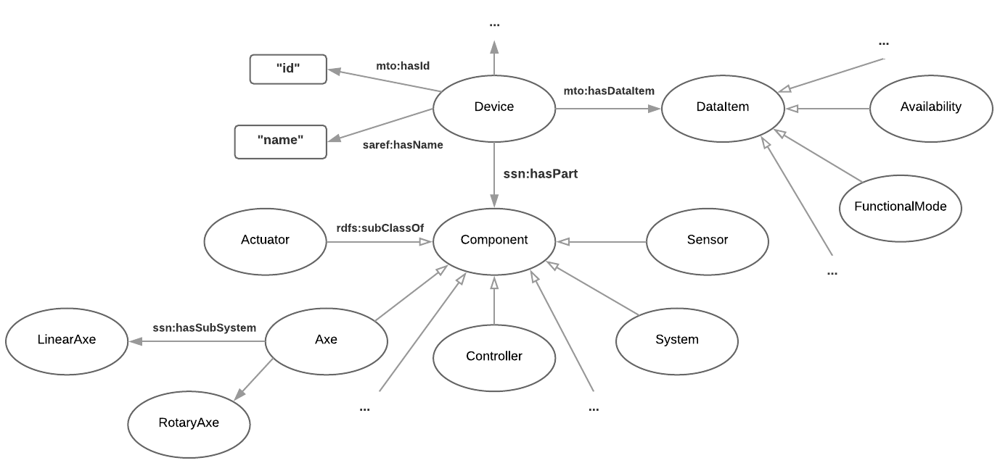

# MTConnect ontology 

This ontology conforms to the [MTConnect](http://www.mtconnect.org/) standard (Version 1.3.1) and includes sample data and queries to proof its functionality. We used [Semantic Web](https://www.w3.org/standards/semanticweb/) technologies for expressing the ontology. 

## Human-readable version
[MTConnect.html](https://cdn.rawgit.com/vocol/MTConnect/9859be75/MTConnect.html)

## Machine-interpretable version
[MTConnect.ttl](https://github.com/vocol/MTConnect/blob/master/MTConnect.ttl)

## Visualization

## Creator
* [Glykeria Alvanou](https://github.com/GlykeriaAlvanou) - MSc Student @ University of Bonn
* [Niklas Petersen](http://np00.github.io/) - Ontology Engineer @ [Fraunhofer IAIS](https://www.iais.fraunhofer.de/) / [University of Bonn](http://sda.tech/)

## Licence 
*to be determined*
